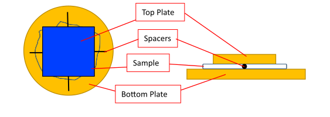

Novocontrol Broadband Dielectric Spectrometer
=============================================

Author: Dan Baker

Setting up a measurement in software
------------------------------------

1. Start **WinDeta** (if it isn't already) and navigate to **Temp. Controller**. 
2. Select **Initialize from Controller**. If this has worked correctly then you should see the temperature of the sample, gas stream and Dewar in the **Status** window. 

.. note::
    You can choose whatever window placement you like within **WinDeta** but I've found that the most efficient is to tile the **Status**, **Message**, **Temperature Log** and **Online** windows together.

3. Navigate to **File => Set File Names** (important to change the name of the output file immediately so that you do not overrite someone else's measurement. )
4. Navigate to **Measurement => Sample Specification** and enter the required information. The **Description** box should contain information about your zsample (this information will appear at the top of any data you produce). 

.. note:: 
    The **Sample diameter** and **Sample thickness** (in mm) should also be entered. For standard measurements (i.e. sample between two round electrodes), the **Cell Stray** should be set to **1** and **Spacer Area** can be set to 0. The checkbox for **Use Dielectric Sample Cell** should be checked.

5. Go to **Measurement=>List Order**. If you only intend to run the sample at roomtemperature and accurate temperature control is not crucial, then only the ‘Frequency’ variable is required in the ‘Order’ column. If you want to have absolute control of the temperature or if you intend to do a range of temperatures, then the ‘Temperature’ variable should also be added to the ‘Order’ column.

.. figure:: _static/dielectric/list_order.png
    :align: center

6. Navigate to **Value Lists** in order to change the range of the variables (i.e. Temperature and Frequency). The standard frequency range is between 10\ :sup:'−2'\ and 10\ :sup:'7'\ Hz, but this can be changed by editing the value list for frequency. Temperatures can be added as needed to the temperature list. The spectrometer will perform a frequency scan (using the values specified in the frequency value list) at each of these temperatures. **IF YOU INTEND TO USE TEMPERATURES IN KELVIN RATHER THAN CELCIUS MAKE SURE THAT THE TEMPERATURE UNIT BOX IS UNCHECKED**.

7. Start the measurement by navigating to **Measurement=>Start**. 

.. note::
    If you want to check the signal at a specific temperature, or if the ‘Temperature’ variable has not been added to the ‘List Order’ (i.e. if you intend to only run at one temperature), then you can set the sample temperature manually by navigating to **Temp. Controller=> Activiation**.

    .. figure:: _static/dielectric/temp_cont_activation.png
        :align: center

    From here, you can enter a ‘Setpoint’ and then check ‘Heating On’. This will then heat the sample to the temperature entered as the setpoint. After the temperature has stabilized (you can check this on the ‘Status’ pane), a frequency sweep at that temperature can be started by navigating to **Measurement=>Start Single Sweep**. Bear in mind that every time you do this, WinDeta will save an .eps file so you will need to change the file name (using **File=>Set File Name**) every time you perform a single sweep.

Exporting the data
------------------

The easiest way to obtain a text file containing the measurement data after a run has been completed is to first load the .eps file into **WinFit**.

Once the file is open in WinFit, navigate to **File=>Save Fit Data As ASCII...**. This will then open a dialogue box from which you can choose which parameters to output to a .txt file.

