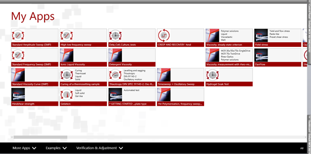

Anton-Paar Rheometer
===========================
Author: Korel Bayram

Initial Set-Up
--------------

1. Open compressed air regulator (should be set to 100PSI).
2. Turn on the water bath.
3. Turn on the rheometer. 
4. Turn on the PC and load Rheocompass (control software)
5. Attach the relevant base plate. Tools for doing so are located next to the machine.
6. Open the 'Control Panel' (right hand side of the screen) and click on 'Initialise'.

    <figure markdown>
    
    </figure>

7. Attach measuring tool to rheometer, set temperature and zero the gap using the same panel used for initialisation.
    <figure markdown>

       
    </figure>

Calibration
-----------

!!! info

    The calibration procedure should be performed at the beginning of your set of measurements using the sample geometry you intend to measure with. 

1. Go to 'My Apps' and click on 'Verification and Adjustment' at the bottom of the page.

    <figure markdown>

       
    </figure>

2. Click on 'Adjust Drive'

    <figure markdown>

       
    </figure>
    

   