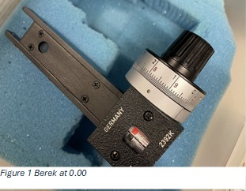
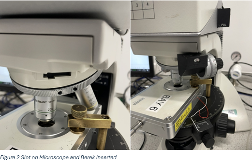
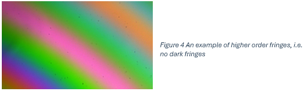
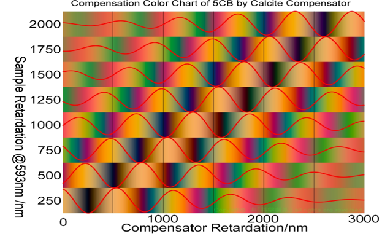
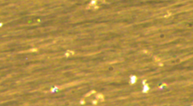

# Berek Compensator 
Author: Conor Blackburn

This document includes instructions on how to acquire data from the Berek Compensator, as an aid for those familiar with microscopy. This document will not go over any microscope alignment and set up nor the background mathematics. **This document does not replace training on a microscope or with use of the Berek Compensator**.

An example will be given below with images

## Preface

Make sure the polarisers in the microscope are crossed (perpendicular) at 90° as this will be important for the working principals. 
The Berek and sample will be crossed along an axis rotated by 45° with respect to the optical axis.
The compensator introduces a birefringence along the axis perpendicular to the optical axis and from this, the retardance and birefringence can be calculated.

## Method

Once the microscope is set up as necessary and the sample in place; rotate the stage and the brightness should change.

1.	Find the extinction position (visually darkest if not pitch black) and note down this angle
2.	 Rotate the stage 45° in the direction of increasing angle (Should look visibly brightest)
(This part will become apparent if rotated in the wrong direction).
3.	Ensure the Berek is at 0.00 (Figure 1) and insert into the slot on the microscope (Figure 2); gloves are recommended here. (The Berek works by rotating a prism, and inserting the Berek at non-zero means there is a likelihood that either a) it gets knocked or b) scratched)

    <figure markdown>
    
    </figure markdown>
    
    <figure markdown>
    
    </figure markdown>
    
4.	Rotate the dial on the Berek and fringes should appear. Rotating in the positive Red and Black directions will produce fringes
5.	Centre the correct fringe (see [this](#tips-for-finding-the-correct-fringe) - a band pass filter can help isolate unwieldy fringes) based on the Michel-Levy chart
6.	Take 3 measurements from the ‘Red side’ and 3 from the ‘Black side’ in order to take an average, ideally alternating between red and black

## How to take a measurements

On the dial of the Berek, there are two tracks of numbers increasing in opposite directions; one set is coloured red and the other set is coloured black. When the fringes appear as the red track is increasing is what has been called the ‘red side’ throughout. 

On the back of the Berek there is a set of seven lines; a central green line with 3 red and 3 black flanking it. Each coloured line corresponds to a 10, up to a maximum measurement of 30. As well as a larger measurement line. The dial has it’s own vernier scale which will then be read and combined with the tens. Any measurements that don’t reach the ‘tens line’ will be the reading on the dial only.

<figure markdown>

</figure markdown>

A calibrated Berek should have symmetric red and black measurements; however a compensator that has been knocked will give different values for the red and black sides. This doesn’t matter as in the maths, both sides are summed.

## Tips for finding the correct fringe

- If higher order fringes appear first, rotate the sample stage by 90°.
    <figure markdown>
    
    </figure markdown>
- A common misconception is that the darkest fringe is the one to measure. This is not necessarily the case.
- A useful tip for especially awkward materials is to take measurements at multiple fringes; only the correct fringe will have a reasonable birefringence.
    <figure markdown>
    
    </figure markdown>

## Full example using liquid crystal cell
| Image | Description |
|:-----:|:------------|
|| Sample in focus at an arbitrary angle |
|| 1. Extinction |
|| 2.	Rotating +45° |
|| 3.	Berek inserted, can see the two sets of fringes on each side; corresponding to red (right) and black (left) |
||4.	Two dark fringes, the Michel-Levy chart tells me that the left hand fringe is correct|
||5.	A 590nm band pass filter allows a clearer centre of the fringe to be visible|
