Bruker NMR: Diffusion Measurements
==================================

Authors: Amjad Alghamdi, Pallavi Kumari and Dan Baker

This document includes instructions on how to set up and run diffusion measurements using the Bruker NMR, as an aid for people who have already been trained. This document **does not replace training**.

Measurement setup
-----------------

<figure markdown>
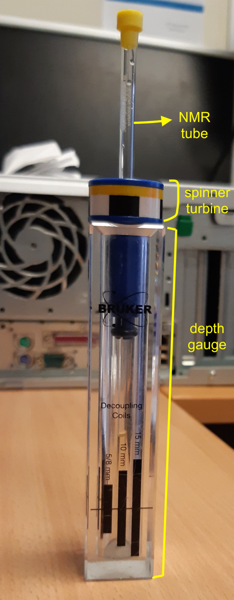{width="150"}
</figure markdown>

0. Insert the NMR tube inside the blue spinner turbine and measure the sample height using the depth gauge (as shown in the figure). Remove the tube from the depth guage with spinner turbine still attached to it. Press the lift button on the BSMS unit and a compressed air will start coming out from the bore of the magnet (the sound of it is loud enough to hear). Now, insert the NMR tube/spinner into the the bore of the magnet. Then, click “lift” again on the BSMS unit to lower the tube.

Open **TopSpin** software (if it isn't already).

1. Pick a pre-existing diffusion measurement and drag the filename from the file explorer into the main window.
    <figure markdown>
    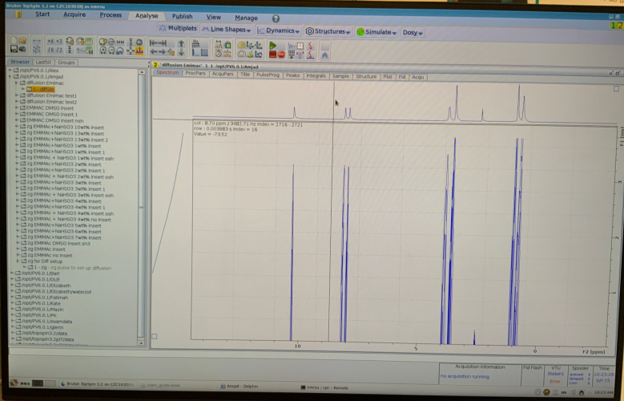
    </figure markdown>

2. Click **Start->Create Dataset** and fill out the **New...** dialogue box:
    - Name will be the name of the measurement folder
    - EXPNO and PROCNO are arbitrary
    - Make sure **use current parameters** is selected.
    - Change **DIR** to be your named folder.

    <figure markdown>
    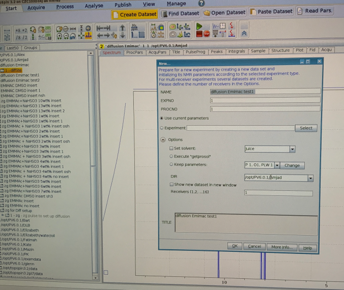
    </figure markdown>

3. Type **"diff"** into the command line. 
4. Enter the **expected diffusion coefficient**
    <figure markdown>
    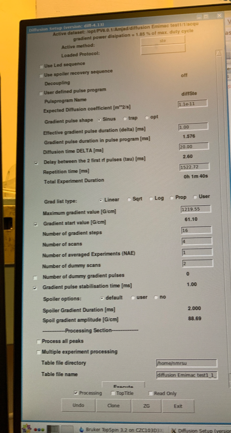
    </figure markdown>

5. Wobble probe ("wobb" on command line)
    <figure markdown>
    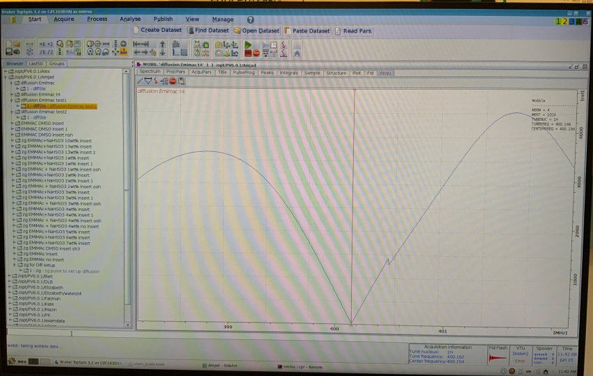
    </figure markdown>

6. Type "zg" to start measurement.

Process FID/spectra
-------------------

1. The FIDs (free induction decays) should decrease as a function of increasing field strength. If the FIDs are all the same height and the magnitudes are relatively large (1e3 or so) then you should go back to 3. and **decrease** the expected diffusion coefficient by a decade. If the FIDs are all a similar height and the magnitudes are relatively small, you should **increase** the expected diffusion coefficient by a decade. 
    <figure markdown>
    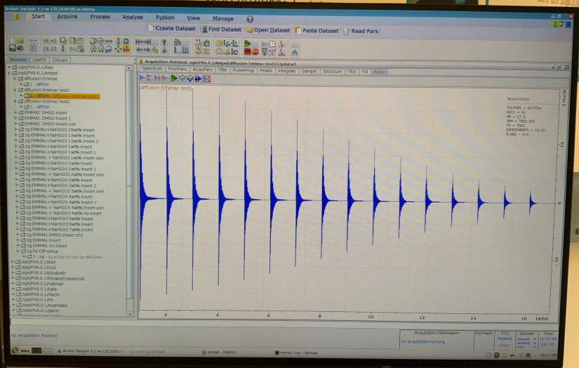
    </figure markdown>

2. Fourier transform the FIDs in the F2 direction by typing **"xf2"** in the command line. 
3. If required, calibrate the ppm axis by going to **Process->Calib. Axis** and picking a peak with known ppm. Enter this into the **F2** box in the dialogue that pops up. 
    <figure markdown>
    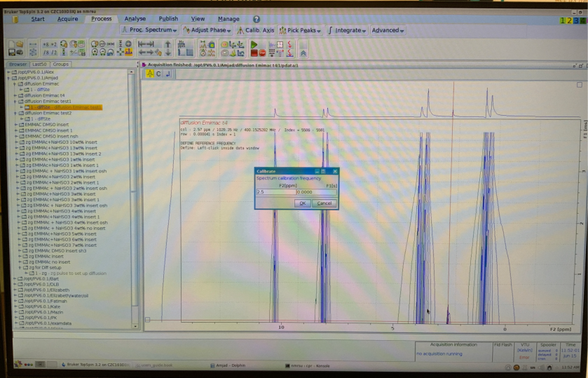
    </figure markdown>

4. Phase the spectra by going to **Process->Adjust Phase**
    <figure markdown>
    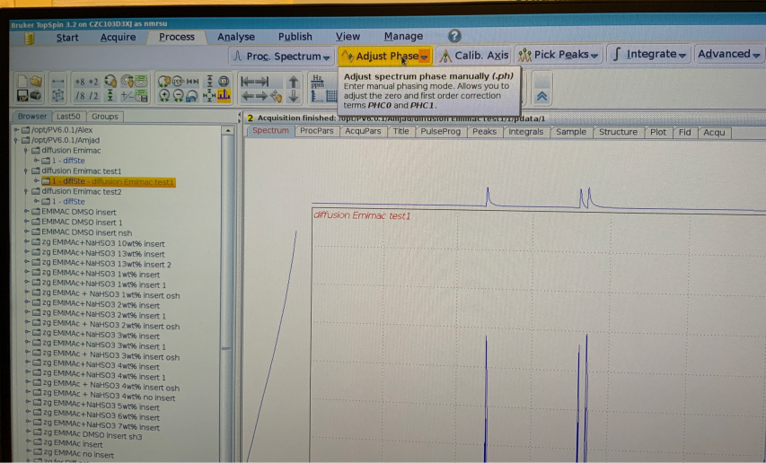
    </figure markdown>

5. Add three spectra to the phase list by right clicking on the graph in different **row** positions. Choose rows at lower field values (maximum intensity), such as 1, 3 and 6. Once these have been added, click **R** in the window ribbon. 
    <figure markdown>
    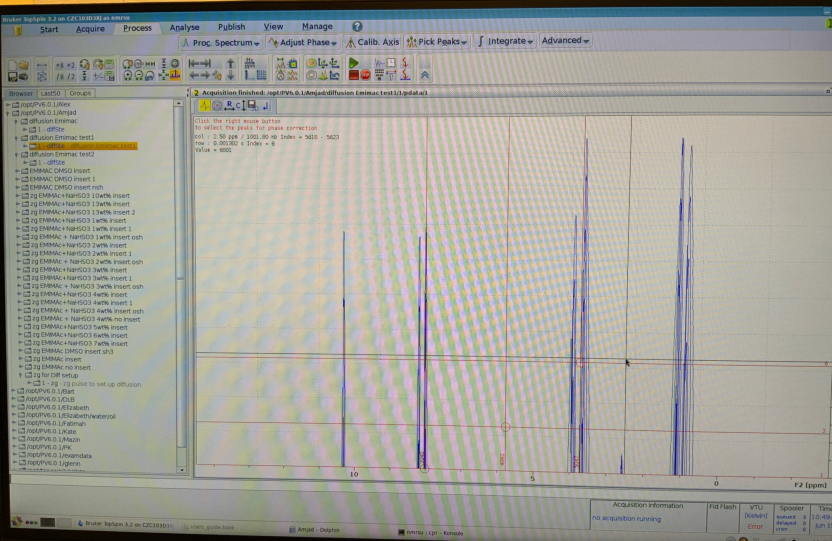
    </figure markdown>

6. Click and hold **0** in the window ribbon and move the mouse up and down to adjust the 0th order phase until the baseline is flat and the peaks are well defined. You might then also need to adjust the 1st order phase in a similar manner by clicking **1** and moving the mouse up and down. 
    <figure markdown>
    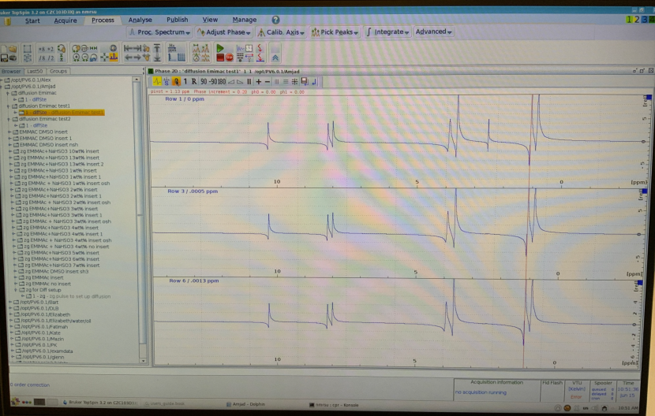
    </figure markdown>

7. Once happy, click the **return and save button** (Save icon with return arrow in the ribbon). 
8. Click **return** 

Determine diffusion coefficient
-------------------------------

1. Go to **Analyse->Dynamics->T1T2(t1t2)**
    <figure markdown>
    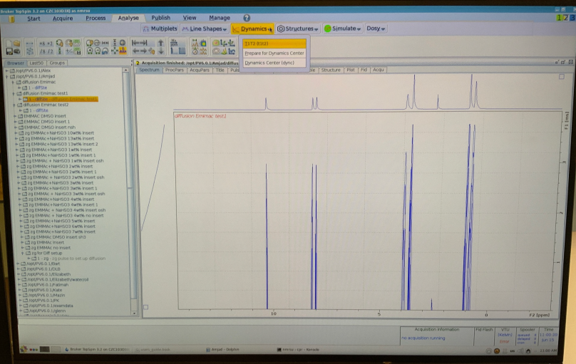
    </figure markdown>    

2. Click **FID** and select **Spectrum** from the resulting dialogue box. Choose **Slice Number** = 1-3. 
    <figure markdown>
    
    </figure markdown>

3. Click **Peaks/Ranges** and select **Manual Integration**. Click **Ok** in the resulting dialogue box. 
    <figure markdown>
    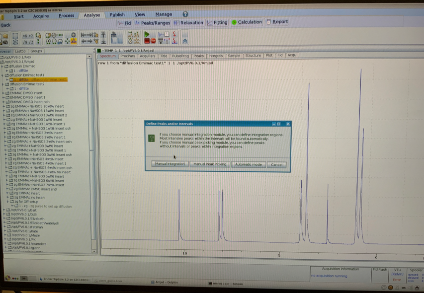
    </figure markdown>

4. Select each peak to analyse by dragging the mouse over each peak. One all peaks have been selected, click the **Save regions** button (save icon with subscript A) and click **Export Regions to Relaxation Module and .ret**. 
    <figure markdown>
    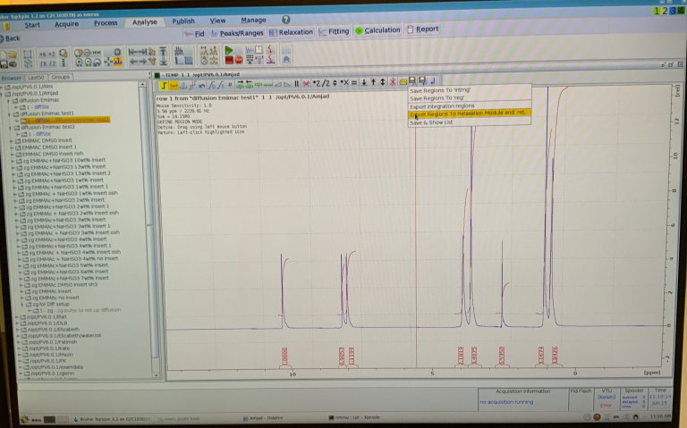
    </figure markdown>

5. Click **Relaxation** in the top banner. 
6. Click the **autoscale** button if you do not see any data.
7. Click the **>>** button to fit all peaks at once in either Intensity or Area. 
    <figure markdown>
    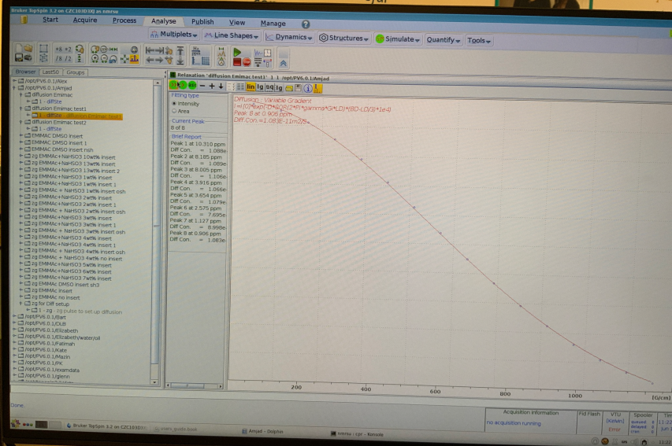
    </figure markdown>

8. To save the fit report (including values of **D**), click **i** (information symbol) and then select **File->Save As**. The convention is to save in **home/NMRSU/NMR data/*Your name*/filename.txt**.
    <figure markdown>
    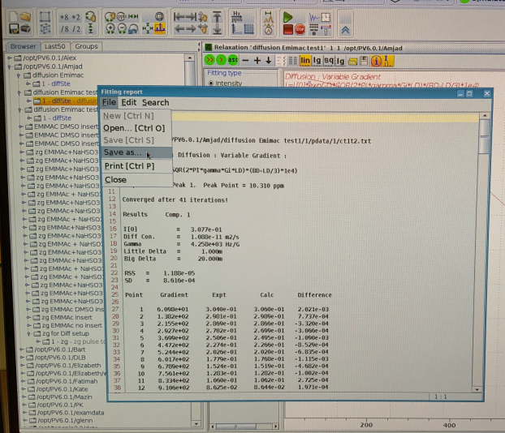
    </figure markdown>

