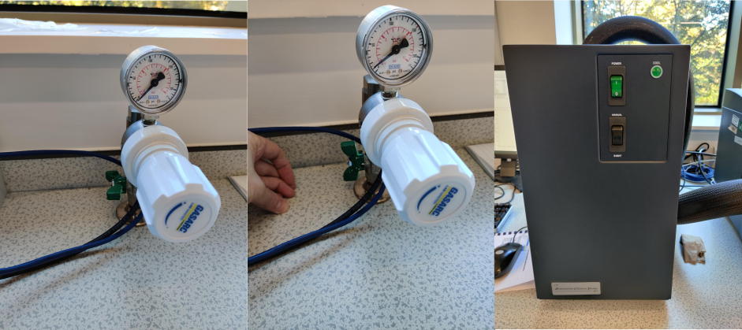
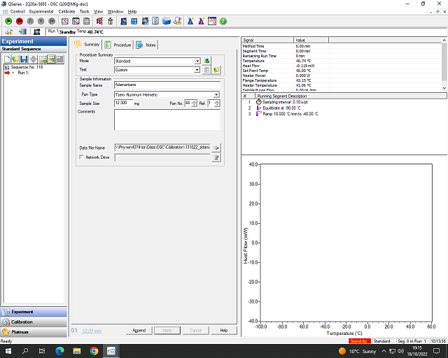
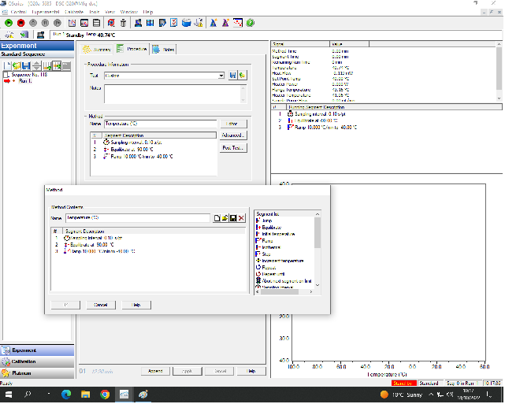

TA Q20 DSC
=============

Author: Dan Baker

Turn on cooling system
---------------------------------

1. Open the nitrogen tap (turn valve so that it is parallel to the pipe). The pressure should already be set. 
2. Switch on the RSC90 (cooling system box) using the green switch. 
3. Activate the cooling system by navigating to **Control** -> **Event** and clicking **On** in the control software.  
    <figure markdown>
    
    </figure markdown>

!!! info
    If the control software is not open already, open **TA Instrument Explorer** and double click on the DSC image.

Sample preparation
------------------

1. Weigh a pan and lid (this will almost certainly be a TZero aluminium hermetic set). The weight should be ~ 51mg. If it's significantly more than this (i.e. ~65mg) then you probably have two lids stuck together. 
2. Tare (zero) the balance.
3. Take the pan off the balance and put some sample in. The amount required is not fixed but you should ensure that there is sufficient sample to cover the bottom of the pan (5-15mg for solid polymers and 1-2 'drops' of a liquid sample is a good starting point, usually). Check weight using the balance.
4. Put the filled pan into the bottom die for the press (blue for the aluminium hermetic pans) and put the lid on top (dimple side down). 
5. Put the die with pan into the press.
6. Pull the lever until it hits the mechanical 'stop'. **This shouldn't require much force at all**
7. Take out the bottom die and place it on the 'post' at the front of the press. This should pop out the filled, and sealed, DSC pan.
8. Measure the weight of the filled pan (should just display the weight of the sample since the balance was tared with the pan and lid on).
9. Place the filled sample pan into an autosampler slot (doesn't matter which but make sure you know which). 

Set up measurement in the software
----------------------------------
<figure markdown>

</figure markdown>

You should fill in all the relevant information in the three central tabs (Summary, Procedure, Notes). 

1. Summary Tab: 

    Fill in the basic sample information in the first tab including: 

    - sample name
    - sample mass
    - slot number
    
2. Procedure Tab: 

    <figure markdown>
    
    </figure markdown>

    - Click **Editor**
    - Add/remove steps as required.
    - Save/load method file as required.

3. Notes Tab: 
    <figure markdown>
    
    </figure markdown>
    
    - Add your name. 
 

