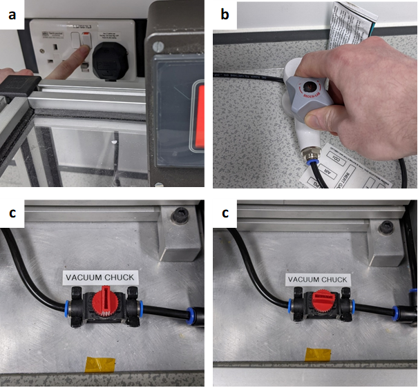
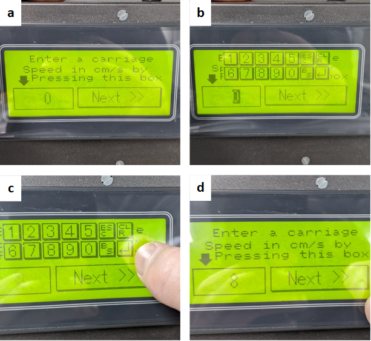
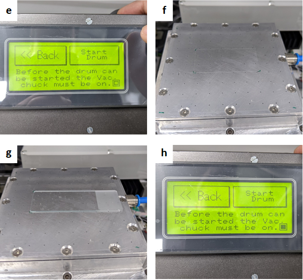
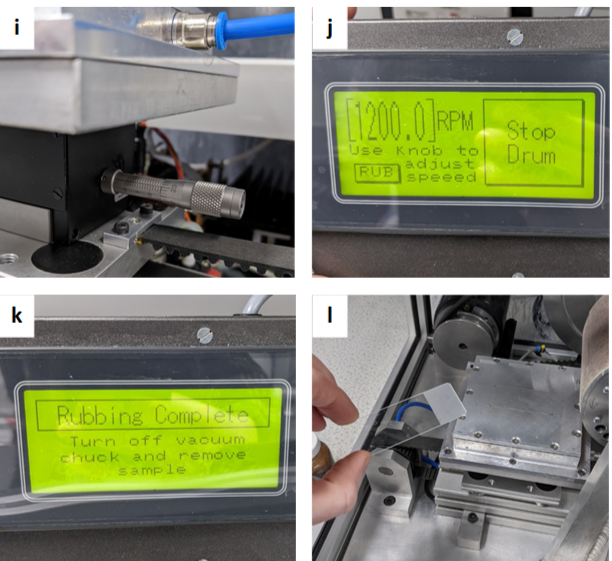
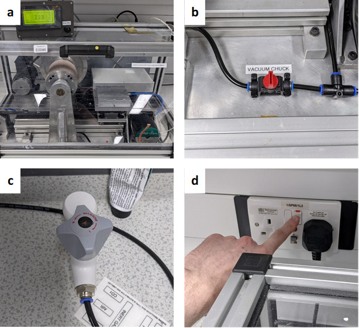

Folium Rubbing Machine
======================
Author: Tom Moorhouse

This document includes instructions on how to set up and run the Folium rubbing machine (RM), as an aid for people who have already been trained. This document **does not replace training**.

<figure markdown>

</figure markdown>

1. Sample Preparation
---------------------

Before using the rubbing machine, ensure you have prepared substrates with an alignment layer to be rubbed. Typically this will be a planar aligning polymer.

**Substrate examples**: Microscope glass, ITO coated glass etc. 
**Alignment layer examples** (planar): PVA, Polyimide, Polystyrene etc.

2. Machine Start-Up
-------------------
a.  Turn on the RM at the mains (Figure 2a). 
b.  To the right of the RM, open the vacuum tap by rotating **anti-clockwise** (open direction indicated with ‘+’ on tap head). 
c.  Open the access door to the RM and turn the red ‘vacuum chuck’ valve to the ON position as shown below. You should now audibly hear air being pulled through the holes in the vacuum stage. 

<figure markdown>

</figure markdown>

d.	The sample stage may not be in its starting position when you come to the RM. 
e.	If this is the case, the control box will display a message. 
f.	Press the touchscreen to return the stage to its start position, this will cause the stage to move to the right on its linear rail. 
g.	Once the stage has returned, the control box will now display ‘RUB’. The RM is now ready for experimental setup. Press ‘RUB’ to continue. 

3. Experimental Setup
---------------------

a.	Once the ‘RUB’ button is pressed, the ‘carriage’ or stage speed selection window will appear. This allows you to specify the sample stage translation speed in **cm/s**. 
b.	To change the speed, press the bottom-left field, indicated by the black arrow. The value in the field will begin blinking and the numerical keyboard will appear, which means it can now be changed. 
c.	Select a value from the numerical keyboard between 2 and 8cm/s. Confirm the selection by pressing the ‘return’ button, highlighted in red below.  

!!! info

    Slow stage speeds (2-4cm/s) appear to cause excess vibrations in the stage during translation. Higher stage speeds allow the drive motor to run smoother, reducing vibrations.

d.	The value in the field will now stop blinking and the numerical keyboard will disappear. Press the value again if you want to change the stage speed or press the ‘Next’ button to continue. 
<figure markdown>

</figure markdown>

e.	The following screen will now be displayed. In the bottom right corner of the screen, there is a checkbox, highlighted in red below. When un-checked, this indicates that there is not a strong enough vacuum being pulled to start the drum i.e. sample is not covering all the vacuum holes on the stage. 
f.	As shown, an acetate sheet with a rectangular section removed is placed on the stage, this covers the vac holes outside the area of your sample. This should be tailored to fit the shape of your substrate/substrates.  
g.	Place your sample on the vacuum stage, covering the remaining vac holes that are not covered by the acetate sheet. 

!!! warning

    Ensure your sample is flat on the surface of the stage and NOT resting on the acetate sheet, as this will angle your substrate and result in uneven rubbing strength.

h.	The vacuum check box will now be **checked** and you can now press ‘Start Drum’ to start the roller. 

<figure markdown>

</figure markdown>

i.	Adjust the sample stage height to vary the rubbing strength. ’14.20’ on the micrometer scale provided uniform planar alignment for a PVA alignment layer on microscope glass (1.05mm thick). Higher values -> larger roller-substrate separation -> lighter rubbing e.g. ’13.00’ will provide harder rubbing than ’14.00’. 

!!! info

    This suggested height may not be perfect in all cases, but provides a good starting point. Adjust accordingly for different substrate thicknesses e.g. melinex/ITO glass etc.

j.	Use the knob on the control box to adjust the roller speed. Anywhere between 500 – 1000rpm should be sufficient for typical cases, but if higher rubbing strengths are required, the roller speed can be safely increased to 2000rpm. 
k.	Check your substrate is positioned as you would like, then press ‘RUB’ on the roller speed screen to commence rubbing. The stage will translate beneath the roller and the ‘Rubbing Complete’ screen will be displayed once it has finished. 
l.	Open the access door, turn off the vacuum using the red vacuum chuck valve and carefully remove your sample.  

!!! info 

    Don’t forget to make a note of the rubbing direction you have just applied, this can be done by carefully drawing a line/arrow on the underside of your substrate (can be done prior to rubbing).

<figure markdown>

</figure markdown>

!!! info 

    If you want to carry out more rubbing, return to step 2d and repeat the process as many times as required.

4. System Shutdown
------------------

a. After your final rubbing pass, return the carriage to its start positon, ready for the next user. 
b. Turn the vacuum chuck valve to the off position, as shown below. 
c. Turn the external vacuum tap clockwise to turn off the vacuum. Don’t overtighten the tap! 
d. Turn the power supply off at the mains. 

<figure markdown>

</figure markdown>

 