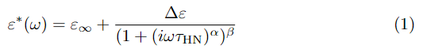

# Latex

## Start a new, blank project in Overleaf

1. Log in to [Overleaf](https://www.overleaf.com)
2. Click 'New Project'
3. Click 'Blank Project'
4. Name it something and click 'Create'.

## Getting started

When 'Blank Project' is selected, Overleaf will open the editor with the following code added in (I called my project 'TestBlankTemplate'): 

``` latex

\documentclass{article}
\usepackage{graphicx} % Required for inserting images

\title{TestBlankTemplate}
\author{Your Name}
\date{February 2025}

\begin{document}

\maketitle

\section{Introduction}

\end{document}

```

All TeX functions are prefaced by backslashes. The main, required argument goes in {} and optional arguments go in []: `\examplefunction[option1, option2]{mainarg}`

- `\documentclass` sets the... class of the...document. There are many prebuilt examples. We can use parameters passed to this function to change various ways in which the document is formatted overall, for example, if we want the document to be a two columned article: `\documentclass[twocolumn]{article}`
- The `\usepackage` function is used to load in extra functionality (like `import` in Python). In this case, `\usepackage{graphicx}` loads the `graphicx' package (so that images can be rendered) into the scope of the current document. 
- `\title` sets the document title (...).
- `\author` sets the document author (you're seeing how straightforward this is, right?).
- `\date` sets the date. If you don't want a date to be displayed, call the function with an empty argument: `\date{}`.
- The main text of the document needs to go in between the `\begin{document}` and `\end{document}` function calls.
- We can use the `\section` function to denote sections within the document (and `\subsection` and `\subsubsection`). 

## Adding equations

To add an equation, we need to create an 'equation' environment. The following is the code you would use to write the Havriliak-Negami function: 

``` latex

\begin{equation}
    \varepsilon^{*}(\omega) = \varepsilon_{\infty} + 
    \frac{\Delta\varepsilon}
    {(1 + (i\omega\tau_{\mathrm{HN}})^{\alpha})^{\beta}}
    \label{eq:HN}
\end{equation}

```

- The `\begin{equation}` and `\end{equation}` lines denote the beginning and end of the equation environment. 
- We can type various symbols by using a backslash and the symbol name (there are loads of 'symbol lists' online and Overleaf has a 'symbol palette'). For example, β would be `\beta`.
- Subscripts and superscripts are rendered using the `_` and `^` symbols. If there are more than one symbol/letter to go in the superscript then you should encase the super-/subscripts in curly braces. For example, to write alpha, subscript 'n', superscript 'tau' you would write: `\alpha_{n}^{3\tau}`.
- We can use `\mathrm{}` to remove the 'mathsy formatting' for letters (i.e. in this case we don't want 'HN' to be italicised). 
- If you want your equation to be 'un-numbered' then you can enclose the equation in `\begin{equation*}` and `\end{equation*}` instead.

This equation renders as: 

<figure markdown>

</figure markdown>

and we can refer to it in the main text using its label: 

```latex

Equation \ref{eq:HN} is the Havriliak-Negami equation. 
```

### Adding inline mathematical symbols

We often need to add 'inline' maths in the main text (to explain what the symbols mean in an equation, for example). You can invoke an inline equation environment by enclosing the things you want to render in `$$`. For example, if we wanted to explain the symbols in our Havriliak-Negami equation: 

``` latex

where $\varepsilon^{*}$ is the complex dielectric permittivity, 
$\varepsilon_{\infty}$ is the permittivity as frequency tends to infinity, 
$\Delta\varepsilon = \varepsilon_0 - \varepsilon_{\infty}$ is the dielectric strength...  

```

<figure markdown>

</figure markdown>

## Adding figures

The first thing we need to do is upload our figure to our Overleaf project. On the left hand side of the screen you should see a box with 'main.tex' in. This is our document file. We can upload a figure by dragging and dropping the file into this box, or we can use the upload button (little up-arrow). Here, I've uploaded a figure called 'samplecell.pdf': 

<figure markdown>

</figure markdown>

To add this into our document, we need to make a 'figure' environment, and load our figure: 

``` latex

\begin{figure}
    \centering
    \includegraphics[width=0.8\linewidth]{samplecell.pdf}
    \caption{Sample cell for the Novocontrol dielectric spectrometer.}
    \label{fig:sample_cell}
\end{figure}

```

- The `\begin{figure}` and `\end{figure}` lines denote the beginning and end of the figure environment. 
- `\centering` centers the figure relative to the page. 
- `\includegraphics` loads the figure itself (main argument in {}). Here, we have used an optional argument to specify that the width of the figure should be 0.8 times the `\linewidth` parameter, which sets the maximum length of a line. By setting the width relative to `\linewidth`, the figure will automatically scale if we, for example, decide to change the margins of the document. 
- `\caption` sets the text which will be displayed under the figure. This will display as "Figure X: Caption Text", where X is the figure number relative to the other figures in the document. This means you don't have to worry about numbering figures!
- `\label` allows us to refer to this figure in the text. 

The resulting figure looks like this: 


<figure markdown>

</figure markdown>

To refer to the figure in the main text, we use the `\ref` command. For example: 

``` latex

Figure \ref{fig:sample_cell} is a schematic of the sample cell for the Novocontrol dielectric spectrometer.  

```