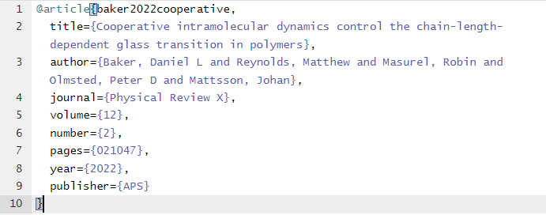

# $\LaTeX$

## Start a new, blank project in Overleaf

1. Log in to [Overleaf](https://www.overleaf.com)
2. Click 'New Project'
3. Click 'Blank Project'
4. Name it something and click 'Create'.

## Getting started

When 'Blank Project' is selected, Overleaf will open the editor with the following code added in (I called my project 'TestBlankTemplate'): 

``` latex

\documentclass{article}
\usepackage{graphicx} % Required for inserting images

\title{TestBlankTemplate}
\author{Your Name}
\date{February 2025}

\begin{document}

\maketitle

\section{Introduction}

\end{document}

```

All $\LaTeX$ functions are prefaced by backslashes. The main, required argument goes in {} and optional arguments go in []: `\examplefunction[option1, option2]{mainarg}`

- `\documentclass` sets the... class of the...document. There are many prebuilt examples. We can use parameters passed to this function to change various ways in which the document is formatted overall, for example, if we want the document to be a two columned article: `\documentclass[twocolumn]{article}`
- The `\usepackage` function is used to load in extra functionality (like `import` in Python). In this case, `\usepackage{graphicx}` loads the `graphicx' package (so that images can be rendered) into the scope of the current document. 
- `\title` sets the document title (...).
- `\author` sets the document author (you're seeing how straightforward this is, right?).
- `\date` sets the date. If you don't want a date to be displayed, call the function with an empty argument: `\date{}`.
- The main text of the document needs to go in between the `\begin{document}` and `\end{document}` function calls.
- We can use the `\section` function to denote sections within the document (and `\subsection` and `\subsubsection`). 

Comments are denoted by `%` - text after a `%` on a particular line will not be compiled by `$LaTeX`, so you can use these to write notes about the function of a particular line, for example.

## Equations

To add an equation, we need to create an 'equation' environment. The following is the code you would use to write the Havriliak-Negami function: 

``` latex

\begin{equation}
    \varepsilon^{*}(\omega) = \varepsilon_{\infty} + 
    \frac{\Delta\varepsilon}
    {(1 + (i\omega\tau_{\mathrm{HN}})^{\alpha})^{\beta}}
    \label{eq:HN}
\end{equation}

```

- The `\begin{equation}` and `\end{equation}` lines denote the beginning and end of the equation environment. 
- We can type various symbols by using a backslash and the symbol name (there are loads of 'symbol lists' online and Overleaf has a 'symbol palette'). For example, β would be `\beta`.
- Subscripts and superscripts are rendered using the `_` and `^` symbols. If there are more than one symbol/letter to go in the superscript then you should encase the super-/subscripts in curly braces. For example, to write alpha, subscript 'n', superscript 'tau' you would write: `\alpha_{n}^{3\tau}`.
- `\frac{}{}` allows us to display fractions as $\frac{a}{b}$ rather than $a/b$. Numerator goes in the first set of braces, denominator goes in the second. 
- We can use `\mathrm{}` to remove the 'mathsy formatting' for letters (i.e. in this case we don't want 'HN' to be italicised). 
- If you want your equation to be 'un-numbered' then you can enclose the equation in `\begin{equation*}` and `\end{equation*}` instead.

This equation renders as: 

<figure markdown>

</figure markdown>

and we can refer to it in the main text using its label: 

```latex

Equation \ref{eq:HN} is the Havriliak-Negami equation. 
```

### Inline mathematical symbols

We often need to add 'inline' maths in the main text (to explain what the symbols mean in an equation, for example). You can invoke an inline equation environment by enclosing the things you want to render in `$$`. For example, if we wanted to explain the symbols in our Havriliak-Negami equation: 

``` latex

where $\varepsilon^{*}$ is the complex dielectric permittivity, 
$\varepsilon_{\infty}$ is the permittivity as frequency tends to infinity, 
$\Delta\varepsilon = \varepsilon_0 - \varepsilon_{\infty}$ is the dielectric strength...  

```

<figure markdown>

</figure markdown>


### Full-size brackets

Let's say we wanted to put brackets around the fraction in our Havriliak-Negami equation. If we just add brackets like this: 


``` latex

\begin{equation}
    \varepsilon^{*}(\omega) = \varepsilon_{\infty} + 
    (\frac{\Delta\varepsilon}
    {(1 + (i\omega\tau_{\mathrm{HN}})^{\alpha})^{\beta}})
    \label{eq:HN}
\end{equation}

```

then the result looks a bit sad...


<figure markdown>

</figure markdown>

We can fix this by using the `\left` and `\right` labels before our left and right brackets and they will resize nicely! So: 


``` latex

\begin{equation}
    \varepsilon^{*}(\omega) = \varepsilon_{\infty} + 
    \left(\frac{\Delta\varepsilon}
    {(1 + (i\omega\tau_{\mathrm{HN}})^{\alpha})^{\beta}}\right)
    \label{eq:HN}
\end{equation}

```

which looks much better!


<figure markdown>

</figure markdown>

### Dealing with long equations

Sometimes we have to write equations that are longer (or close to) the line width. For example, let's write the Ericksen-Leslie solution for viscosity in nematic liquid crystals: 

``` latex

\begin{equation}
    \sigma_{\alpha\beta} 
    = \alpha_1\left(n_\alpha n_\beta n_\mu n_Q A_{\mu Q}\right)
    + \alpha_2\left(n_\alpha N_\beta\right)
    + \alpha_3\left(n_\beta N_\alpha\right)
    + \alpha_4\left(A_{\alpha\beta}\right) 
    + \alpha_5\left(n_\alpha n_\mu A_{\mu\beta}\right)
    + \alpha_6\left(n_\beta n_\mu A_{\mu\alpha}\right)
\end{equation}

```

This renders as: 

<figure markdown>

</figure markdown>

which doesn't look totally awful, but is long enough that it pushes the equation number to the next line and isn't completely ideal... One way to solve this problem is to split the equation on to multiple lines and align those lines with a fixed reference point. We can do this with the `amsmath` package: `\usepackage{amsmath}` and the `\split` environment it provides: 

``` latex

\begin{equation}
    \begin{split}
    \sigma_{\alpha\beta} 
    & = \alpha_1\left(n_\alpha n_\beta n_\mu n_Q A_{\mu Q}\right) \\
    & + \alpha_2\left(n_\alpha N_\beta\right) \\
    & + \alpha_3\left(n_\beta N_\alpha\right)\\
    & + \alpha_4\left(A_{\alpha\beta}\right) \\
    & + \alpha_5\left(n_\alpha n_\mu A_{\mu\beta}\right)\\
    & + \alpha_6\left(n_\beta n_\mu A_{\mu\alpha}\right)\\
    \end{split}
\end{equation}

```

The `&` symbol sets the point at which each line in the split will be aligned to (here I've chosen this to be at the equals sign for the first line and the plus signs thereafter). As usual, the `\\` symbol denotes a new line. This results in: 

<figure markdown>

</figure markdown>

We can pick an choose where to do this alignment. If we wanted two terms per line instead, and align the plus signs with the first $\alpha$ symbol rather than the equals sign:

``` latex
\begin{equation}
    \begin{split}
    \sigma_{\alpha\beta} 
     = & \alpha_1\left(n_\alpha n_\beta n_\mu n_Q A_{\mu Q}\right) 
      + \alpha_2\left(n_\alpha N_\beta\right) \\
    & + \alpha_3\left(n_\beta N_\alpha\right)
      + \alpha_4\left(A_{\alpha\beta}\right) \\
    & + \alpha_5\left(n_\alpha n_\mu A_{\mu\beta}\right)
      + \alpha_6\left(n_\beta n_\mu A_{\mu\alpha}\right)\\
    \end{split}
\end{equation}
```

<figure markdown>

</figure markdown>

## Figures

The first thing we need to do is upload our figure to our Overleaf project. On the left hand side of the screen you should see a box with 'main.tex' in. This is our document file. We can upload a figure by dragging and dropping the file into this box, or we can use the upload button (little up-arrow). Here, I've uploaded a figure called 'samplecell.pdf': 

<figure markdown>

</figure markdown>

To add this into our document, we need to make a 'figure' environment, and load our figure: 

``` latex

\begin{figure}[]
    \centering
    \includegraphics[width=0.8\linewidth]{samplecell.pdf}
    \caption{Sample cell for the Novocontrol dielectric spectrometer.}
    \label{fig:sample_cell}
\end{figure}

```

- The `\begin{figure}` and `\end{figure}` lines denote the beginning and end of the figure environment. We can use the square brackets after the `\begin{figure}` call to specify the priority that $\LaTeX$ should use when positioning the figure on the page. For example, if we use `\begin{figure}[htbp]`, this means, first, $\LaTeX$ will try to place the figure 'here' (i.e. the position in the text where the figure is called), and then the 'top', 'bottom', and finally a whole 'page'.
- `\centering` centers the figure relative to the page. 
- `\includegraphics` loads the figure itself (main argument in {}). Here, we have used an optional argument to specify that the width of the figure should be 0.8 times the `\linewidth` parameter, which sets the maximum length of a line. By setting the width relative to `\linewidth`, the figure will automatically scale if we, for example, decide to change the margins of the document. 
- `\caption` sets the text which will be displayed under the figure. This will display as "Figure X: Caption Text", where X is the figure number relative to the other figures in the document. This means you don't have to worry about numbering figures!
- `\label` allows us to refer to this figure in the text. 

The resulting figure looks like this: 


<figure markdown>

</figure markdown>

To refer to the figure in the main text, we use the `\ref` command. For example: 

``` latex

Figure \ref{fig:sample_cell} is a schematic of the sample cell for the Novocontrol dielectric spectrometer.  

```

## Tables

To add a table, we can use the - you guessed it - 'Table' environment: 

``` latex

\begin{table}[]
    \centering
    \begin{tabular}{c|c}
         &  \\
         & 
    \end{tabular}
    \caption{Caption}
    \label{tab:my_label}
\end{table}

```
- The `\begin{table}` and `\end{table}` lines denote the beginning and end of the table environment. We can use the square brackets after the `\begin{table}` call to specify the priority that $\LaTeX$ should use when positioning the table on the page. For example, if we use `\begin{table}[htbp]`, this means, first, $\LaTeX$ will try to place the table 'here' (i.e. the position in the text where the table is called), and then the 'top', 'bottom', and finally a whole 'page'. 
- `\centering` centers the table relative to the page.
- The actual table is rendered within the 'tabular' block (between `\begin{tabular}` and `\end{tabular}`). The second set of `{}` after `\begin{tabular}` are used to specify the number of columns and how the text within those columns is aligned e.g. `{c|c}` means two columns with a single vertical line between with the text centered in each column. 
- Values are added to the table using `&` between columns. The end of a row is denoted by `\\`
- `\caption` sets the text which will be displayed under the table. This will display as "Table X: Caption Text", where X is the table number relative to the other tables in the document.
- `\label` allows us to refer to this table in the text. 

Let's imagine we have a set of Young's moduli data for some composite samples and we'd like to add this to a report:

<figure markdown>

</figure markdown>

So, we need a table with 6 columns and fill it up with data. We'd also like to:

1. Have the column headings in bold.
2. Have a horzontal line separating the column headings from the data.
3. Have the 'Average' and 'Standard Error' values for each 'orientation' span 3 rows (to centre them within the three rows that they refer to).

``` latex

\begin{table}[]
    \centering
    \begin{tabular}{|c|c|c|c|c|c|}
        \hline
        &&&&&\\
        \textbf{Orientation} & \textbf{Sample 1} & \textbf{Sample 2} & \textbf{Sample 3} & \textbf{Average} & \textbf{Standard Error}  \\
        &\textbf{(GPa)}&\textbf{(GPa)}&\textbf{(GPa)}&\textbf{(GPa)}&\textbf{(GPa)}\\
        &&&&&\\
        \hline
        &&&&& \\ 
        0 - 1&	3.05&	2.71&	1.96&   \multirow{3}{*}{3}& \multirow{3}{*}{0.5}\\
        0 - 2&	3.34&	3.43&	2.44&&\\
        0 - 3&	3.28&	3.61&	3.47&&\\
        &&&&&\\
        45 - 1&	2.54&	2.2&	2.39&   \multirow{3}{*}{2.2}&   \multirow{3}{*}{0.4}\\
        45 - 2&	2.43&	1.03&	2.1&&\\
        45 - 3&	2.39&	2.38&	2.29&&\\				
        &&&&&\\
        90 - 1&	4.2&	3.61&	1.05&	\multirow{3}{*}{3.4} &  \multirow{3}{*}{1}\\
        90 - 2&	3.56&	4.81&	3.98&&\\
        90 - 3&	3.52&	2.37&	3.21&&\\
        &&&&&\\
        \hline
    \end{tabular}
    \caption{Young's modulus}
    \label{tab:ym_table}
\end{table}

```

- `\begin{tabular}{|c|c|c|c|c|c|}` says that we want 6 columns, separated by vertical lines, with the contents centred. Note we've also used vertical lines on the outsides of the columns so that the table is 'boxed'. 
- `\hline` draws a horizontal line across the span of the table (we can use these to 'enclose' tables with a top/bottom too, as I have here).
- `\textbf{}` makes the text within the braces bold. 
- Values in the table are separated with `&` (if $n$ is the number of columns, there will always be $n-1$ `&`s on any particular row). If we want to leave a row entry empty, we just don't put anything between the `&` (so, we can leave a whole line empty by doing `&&&&&\\` )
- Rows are terminated with `\\` (line break).
- We can use the `\multirow` package (`\usepackage{multirow}` at the beginning of the document) to specify that a value should span over multiple rows (3 in our case). The value in the first set of braces indicates the number of rows to span over, the second value specifies what the width of the contents should be (use `*` to indicate that the value should span to the pre-defined width of the column), and the third is the text to actually render. So, `\multirow{3}{*}{0.5}` would render `0.5`, spanning 3 rows, using all the available width of the column. 

The result looks like this: 

<figure markdown>

</figure markdown>

## References

!!! warning
    I (Dan) don't use 'reference managers' at all. It's totally possible that your reference manager can produce a .bib that you can use in your $\LaTeX$ documents, and if you discover that it does then it would be great if you could write some instructions for doing that, and we can add them here too!

References for $\LaTeX$ are managed/compiled using 'BibTeX' and references are stored in '.bib' files. 

Let's say we want to reference this glorious paper: [Cooperative Intramolecular Dynamics Control the Chain-Length-Dependent Glass Transition in Polymers](https://journals.aps.org/prx/abstract/10.1103/PhysRevX.12.021047) in our document: 

1. Make a new document in the Overleaf project and call it something .bib (I'll use 'references.bib' for this example). 
2. Copy the title of the paper and paste it into [Google Scholar](https://scholar.google.com/).
3. Click the 'Cite' button at the bottom of the reference listing. 
    <figure markdown>
    
    </figure markdown>
4. Click the BibTex button in the 'Cite box' that pops up. 
    <figure markdown>
    
    </figure markdown>
5. Copy the whole text of the resulting reference and paste it into your .bib file. 
    <figure markdown>
    
    </figure markdown>

6. Add the following lines just before the `\end{document}` call (rename 'references' to whatever your bib is called).
    ``` latex
    \bibliographystyle{ieeetr}
    \bibliography{references}

    ```

    `\bibiographystyle` sets the style of the bibliography (...) and `\bibliography` loads the actual references (this won't work without a style).

7. We can now refer to our paper using its 'handle': the bit of text just after the @article definition - in this case, 'baker2022cooperative': 
    
    ``` latex

    The only correct theory about the relationship between $T_{g}$ and $M_{w}$ \cite{baker2022cooperative} states that... 


    ```
    <figure markdown>
    
    </figure markdown>


## Other useful things

### Force figure/table placement

$\LaTeX$ will automatically try and place floats (e.g. figures and tables) in the 'place that makes most sense' in terms of page usage. If you're making a document with relatively minimal text (for a meeting or something) then this can mean that all your figures get bunched up at the end; 'correct' figure placement is subjective! If you just want your figures to appear in the position they are called (and `\begin{figure}[htbp]` isn't working), then you can include the following package to force the behaviour you (probably) want: 

``` latex

\usepackage[section]{placeins}

```


## Leeds Thesis Template

In this section, I'm going to explain how to get started with the 'Leeds Thesis Template' that has been going around since 2003 or so. I won't explain literally every command but this should allow you to start writing... 

To start a new project using the Leeds Thesis Template: 

1. Download the latest .zip of the template from our Teams space (General -> Files)
2. Go to [Overleaf](https://www.overleaf.com) and click 'New Project'.
3. Click 'Upload Project' 
4. Drag .zip into the window / click to browse your PC for the .zip. 

### Project Structure

- `thesis.tex` is the 'entry point' for the thesis. You could, technically, add all your text / images etc into this file and have your entire thesis in one big file, but that would be a complete nightmare... 
- `Classes\myThesis.cls` is the custom document class for this template (it is loaded at the top of `thesis.tex`: `\documentclass[twoside,12pt]{Classes/myThesis}`). This class defines custom environments for the Acknowledgements, Abstract, etc and also sets the spacing for the title page, loads packages and so on. 
- If you scroll down `thesis.tex` you will see some `\include` statements (starting on line 49 with `\include{Dedication/dedication}`). Include statements allow you to include other .tex files as if you have copy/pasted their contents straight into `thesis.tex`. This allows us to separate different sections of our thesis into separate files which helps with organisation but also with compile time: when your thesis starts getting large (multiple chapters, lots of figures etc etc) then it can take a while to compile the whole thesis, which is annoying when you're trying to see how a particular edit is affecting the document. To solve this, you can comment out (add `%` to the beginning of the line) the `\include` statements of chapters/sections you aren't currently editing and that will make the resulting .pdf render faster!
- Each of the included .tex files has its own folder, but this is completely arbitrary. If you wanted to make things even simpler, you could just make a big folder called 'StuffAtBeginning' and stick all the .tex files for the Acknowledgements, Abstract etc in there instead. You would then just change the `\include` statements to have the correct path: 
    
    ``` latex
    ...
    \include{StuffAtBeginning/dedication}
    \addcontentsline{toc}{chapter}{Acknowledgement}
    \include{StuffAtBeginning/acknowledgement}
    \addcontentsline{toc}{chapter}{Abstract}
    \include{StuffAtBeginning/abstract}
    \addcontentsline{toc}{chapter}{Abbreviations}
    \include{StuffAtBeginning/Abbreviations}
    ...

    ```

### Adding a chapter

If you look at the project structure window (left hand side), you'll see that there is already an `Introduction` folder. If we open `Introduction\Introduction.tex`, we get an example of how to add text / figures to a chapter: 

``` LaTeX

%=== Chapter One ===
\chapter{Introduction}
\graphicspath{{Introduction/IntroductionFigs/}}

\section{Introduction}

Ever advancing developments in computational power....

\begin{figure}[htbp]
\begin{center}
  \mbox{
     \subfigure[]{{\includegraphics[width=3.2in, angle=-0]{ScaleCartoon.eps}}}
     \subfigure[]{{\includegraphics[width=1.6in, angle=-0]{Introduction/IntroductionFigs/ScaleCartoon.eps}}}
       }
   \caption{Simulation Scale Cartoon \citep{nielsen2004cgm}.}
   \label{fig:Simscale}
\end{center}
\end{figure}

\subsection{Background}

```

- `\chapter{Introduction}` sets the title of the Chapter. 
- `\graphicspath{Introduction/IntroductionFigs}` adds `Introduction/IntroductionFigs` to the path that $\LaTeX$ uses to look for figures when we include them. This means we can include figures directly by their filename without having to include their entire path (e.g. `\subfigure[]{{\includegraphics[width=3.2in, angle=-0]{ScaleCartoon.eps}}}`). We don't have to do this - we could also call them by using their whole path (e.g. `\subfigure[]{{\includegraphics[width=1.6in, angle=-0]{Introduction/IntroductionFigs/ScaleCartoon.eps}}}`).

If we go back to `thesis.tex` and scroll down to just after the `\mainmatter` call, then we can see our Introduction chapter included: `\include{Introduction/Introduction.tex}`. If we wanted to add another chapter, we could make a new folder called, for example `Chapter 2` and put a `Chapter2.tex` file in the folder. If we wanted, we could also add a folder for figures: `Chapter2Figs`. We could then add the following to `Chapter2.tex`:

``` LaTeX

%=== Chapter Two ===
\chapter{Chapter 2: Electric Boogaloo}
\graphicspath{{Chapter2/Chapter2Figs/}}

\section{More Science}
 blah blah blah blah
```

and add it to our thesis by including it in `thesis.tex`, by writing the line `\include{Chapter2/Chapter2.tex}` under the include statement for the first chapter.


## New Thesis Template

We can structure the 'thesis' project in a completely different way. For example, we could structure it like this: 

<figure markdown>

</figure markdown>

In this new structure, we have all the figures, front matter, chapters and references in relevant folders. If we want to add a new chapter, we'd just add a new `.tex` file to the `Chapters` folder and set the `\graphicspath` to a new folder in the `Figures` folder. We could then include the new chapter in the thesis by adding `\include{Chapters/NewChapter}` to `thesis.tex`.

## Compile $\LaTeX$ without Overleaf 

So far we have only considered Overleaf as an option for compiling $\LaTeX$ documents, but that isn't the only option. The following are instructions for how to compile $\LaTeX$ documents on your PC (well, one of the many ways...): 

1. Download [MikTek](https://miktex.org/download) and install it as a user (you don't need admin rights or AppsAnywhere or permission from the king). At some point it will give you a choice whether you want to 'Install missing packages on-the-fly' or not; for the most 'Overleaf-like' experience, I would say 'yes'. 
2. Open PowerShell and change directory, `cd`, to a folder containing the document you want to compile. As an example, let's go to a thesis folder: 
    
    ``` PowerShell
    cd "C:\Users\YourUsername\Thesis"

    ```

3. We now need to:
    - run `pdflatex` to generate some output files,
    - run `bibtek` on the `.aux` file that was generated to sort the references, 
    - run `pdflatex` two more times to sort internal references and to link the biliography properly. 

    In one line (assuminig our `.tex` file is called `thesis.tex`): 

    ``` PowerShell
    
    pdflatex.exe .\thesis.tex && bibtex.exe thesis.aux && pdflatex.exe .\thesis.tex && pdflatex.exe .\thesis.tex

    ```


This will be quite slow the first time (MikTek will probably have to download some packages), but subsequent compilations should be much faster (my thesis compiles from 'scratch' in about 10 seconds). 