# Novocontrol Broadband Dielectric Spectrometer

Author: Caitlin Probert

## Experimental Background

The polarisation of a material can be influenced by the presence of an electric field.  When a small perturbation is introduced by this field the permanent dipoles of the system will reorient themselves to align with the field, as this is the lowest energy state.  Once the perturbation is removed the dipoles will relax to their equilibrium state; this relaxation of the macroscopic polarisation is heavily reliant on the underlying microscopic dynamics of the system, and typically follows the same behaviour.  As a result, the dielectric profile of a material can be used to study its relaxation mechanisms.

The dielectric bridge measures the relaxations through impedance.  A sample is sandwiched between two conducting plates with a surface area A, separated by a distance d; this layout essentially creates a filled capacitor with a complex capacitance given by:

$$ 
C^{*} = \frac{\varepsilon^{*}\varepsilon_{0}A}{d}
$$

Where :math:`\varepsilon^{*}` is the complex permittivity of the material, and :math:`\varepsilon_{0}` is the permittivity of free space. A sinusoidally varying voltage is applied to the plates of the form: 

$$
    V(\omega)=V_{0}e^{i\omega t}
$$
This results in a complex current with a phase difference :math:`\phi` to the voltage, which is measured: 

$$
    I(\omega)=I_{0}e^{i(\omega t+\phi(\omega))}
$$

From this we can calculate a complex impedance, using Ohm’s law, that can be related to several material dependent variables (such as complex permittivity).

## Sample preparation

A sample should, generally, be constructed in a similar manner to the diagram below: 
<figure markdown>
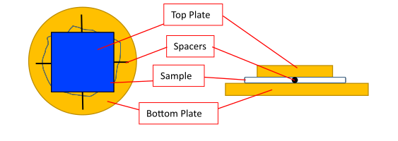
</figure markdown>

The spacers are usually silicon rods with a 100μm thickness, though different thicknesses may also be used. Different spacer material can also be used; however, the area and capacitance of the spacers need to be considered. 

Plate sizes can also vary; larger plates are usually better for samples with qa weak dielectric signal as a larger area yields a larger signal. 

For more fluid samples, there is a liquid cell as shown below: 

<figure markdown>
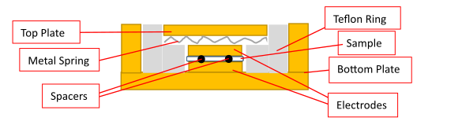
</figure markdown>

##  Experimental Setup - Software

The Novocontrol bridge is controlled by the WinDETA software.  There are several steps to prepare an experiment both through the software and the externally connected hardware.

On the software there are four windows that are useful during the experiment: Status, Message, Multi Graphics and Temperature Log. 
<figure markdown>
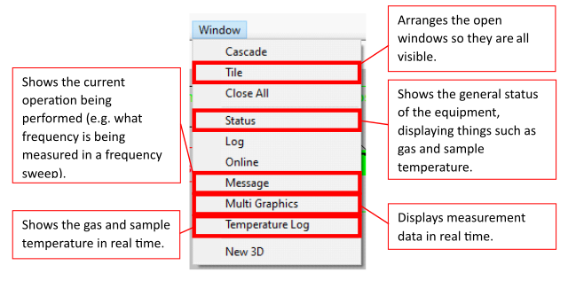
</figure markdown>

These give useful information about what is going on with the equipment and measurement during a run. The windows can be opened via the **Window** tab as shown above.

You will need to activate communication between the software and hardware via **Temp. Controller>Initialize WinDETA from controller**.

<figure markdown>
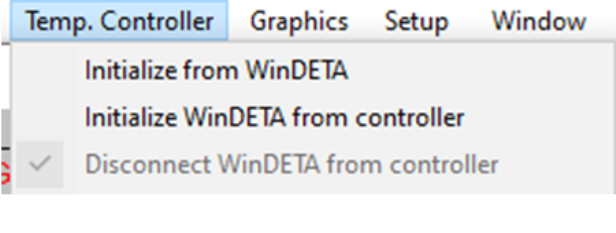
</figure markdown>

### Set up measurement on a sample

Set file names via **File>Set File Names**. This assigns a location where your measurement/data will be stored.

<figure markdown>
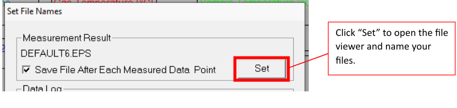
</figure markdown>

Set sample specifications via **Measure>Sample Specification**. This is where you input details about the thickness, area and spacers. 
<figure markdown>
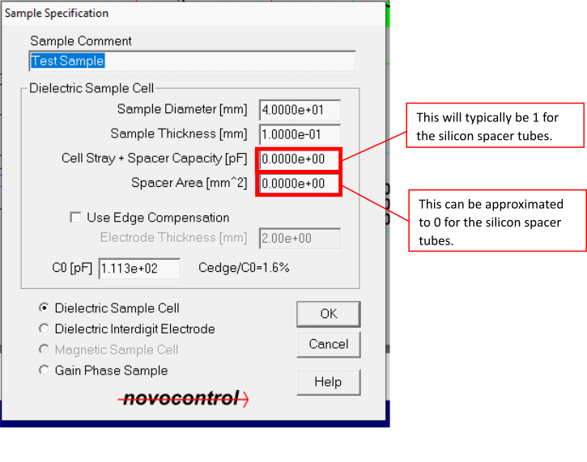
</figure markdown>

Set the variables you wish to control via **Measure>List Order**. This tells the software what you wish to change (e.g. temperature) and what you are measuring as a function of (e.g. frequency). This will also determine the order in which things are done i.e. whether you measure frequency sweeps at different temperatures or vice versa. 

<figure markdown>
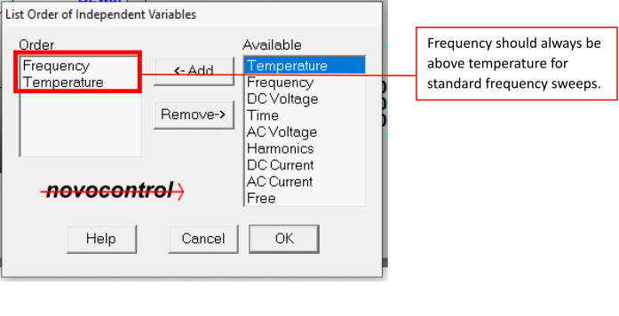
</figure markdown>

Set your temperature and freqency values via **Measure>Value Lists>Temperature (or Frequency)**. This sets the temperatures and frequencies over which you wish to measure.  The machine is capable of a large frequency range; however, frequencies at or around 10\ :sup:`7` Hz push the limits of the equipment and may not give reliable results.  Conversely, frequencies at 10\ :sup:`-2`  Hz take a long time to measure and too many of these will increase the run length significantly.  When selecting temperatures, be careful to **select the correct unit**.  The temperature will often depend on the sample itself and what the region of interest is. 

<figure markdown>
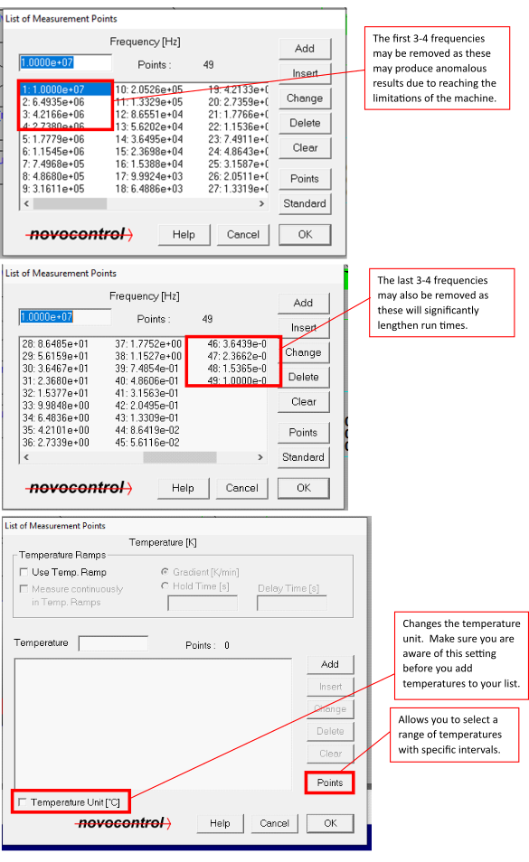
</figure markdown>

When the measurement is set up completely, it is best to do a test run via **Measure>Start Single Sweep** to make sure there are no initial issues such as short circuits or poor connections.  Short circuits will appear as very high conductivity with a slope of 1 (this may be difficult to distinguish from samples that simply have a high conductivity such as water-based samples or salts), if this is present and unexpected then there is likely a gap/hole in the sample that means there is direct contact between the electrodes.

If you wish to perform test measurements (single sweeps) at specific temperatures, the temperature can be controlled manually via **Temp. Controller>Activation**.  A temperature can be set that you wish your sample to reach (**Setpoint**) and the heaters can be activated.

---

**Note**

The sample holder **must** be in the cryostat for the heaters to be able to change the temperature.

--- 

<figure markdown>

</figure markdown>

The sample and gas temperature can be monitored both on the **Status** or **Temperature Log** windows and the screen on the dielectric analyser itself. 

Measurements are monitored through the Multi Graphics windows and different parameters can be monitored via **Graphics>Axes Configuration**.

<figure markdown>
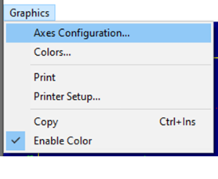
</figure markdown>

## Experimental Setup - Hardware

The bridge consists of a frequency analyser, a sample cell and a temperature control system (comprising of a cryostat, thermocouples and a liquid nitrogen Dewar).  The sample between the electrodes is mounted in the sample cell, which can be tightened to secure the electrodes.  The sample cell is used to apply the voltage across the sample and measure the resulting current.  The cell is placed in a cryostat during the measurements so that the temperature can be controlled using pressurised nitrogen gas.  There are two heaters, one at the bottom of the Dewar and one between the Dewar and the cryostat, which regulate the gas temperature to control the cell/sample temperature.  The basic Dewar setup and sample cell are shown below.

<figure markdown>
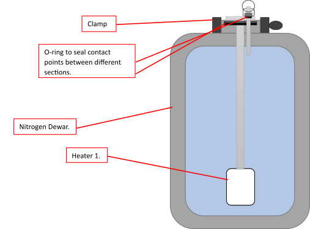
</figure markdown>

<figure markdown>
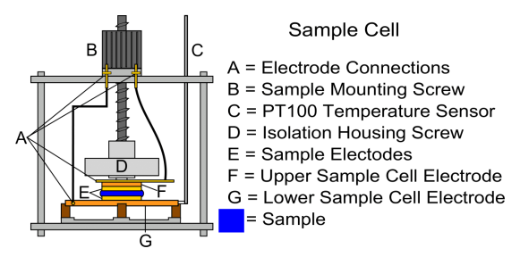
</figure markdown>

When securing the sample cell, the sample should be flat and flush against both electrodes and the screw should only need to be finger tight (i.e. not overtightened or tightened with tools).  Tightening and loosening the screw can loosen the electrode connection in contact with the upper electrode (F); when this is too loose or disconnected artefacts will appear in your measurements.  Check that this is secure before running measurements.  If this is not secure, it can be tightened similarly to the mounting screw (B) but should not rotate such that the isolation housing screw (D) rotates with it.  **THE ISOLATION HOUSING SCREW SHOULD NOT BE ROTATED OR MOVED EXCESSIVELY**.  

<!-- .. Setting up a measurement in software
.. ------------------------------------

.. 1. Start **WinDeta** (if it isn't already) and navigate to **Temp. Controller**. 
.. 2. Select **Initialize from Controller**. If this has worked correctly then you should see the temperature of the sample, gas stream and Dewar in the **Status** window. 

.. .. figure:: _static/dielectric/initialize_from.png
..     :align: center

.. .. note::
..     You can choose whatever window placement you like within **WinDeta** but I've found that the most efficient is to tile the **Status**, **Message**, **Temperature Log** and **Online** windows together.

.. .. figure:: _static/dielectric/Windeta_typical.png
..     :align: center

.. 3. Navigate to **File => Set File Names** (important to change the name of the output file immediately so that you do not overrite someone else's measurement. )
.. 4. Navigate to **Measurement => Sample Specification** and enter the required information. The **Description** box should contain information about your zsample (this information will appear at the top of any data you produce). 

.. .. figure:: _static/dielectric/sample_specification.png
..     :align: center

.. .. note:: 
..     The **Sample diameter** and **Sample thickness** (in mm) should also be entered. For standard measurements (i.e. sample between two round electrodes), the **Cell Stray** should be set to **1** and **Spacer Area** can be set to 0. The checkbox for **Use Dielectric Sample Cell** should be checked.

.. .. figure:: _static/dielectric/sample_diagram.png
..     :align: center

.. 5. Go to **Measurement=>List Order**. If you only intend to run the sample at roomtemperature and accurate temperature control is not crucial, then only the ‘Frequency’ variable is required in the ‘Order’ column. If you want to have absolute control of the temperature or if you intend to do a range of temperatures, then the ‘Temperature’ variable should also be added to the ‘Order’ column.

.. .. figure:: _static/dielectric/list_order.png
..     :align: center

.. 6. Navigate to **Value Lists** in order to change the range of the variables (i.e. Temperature and Frequency). The standard frequency range is between 10\ :sup:'−2'\ and 10\ :sup:'7'\ Hz, but this can be changed by editing the value list for frequency. Temperatures can be added as needed to the temperature list. The spectrometer will perform a frequency scan (using the values specified in the frequency value list) at each of these temperatures. **IF YOU INTEND TO USE TEMPERATURES IN KELVIN RATHER THAN CELCIUS MAKE SURE THAT THE TEMPERATURE UNIT BOX IS UNCHECKED**.

.. .. figure:: _static/dielectric/temp_list.png
..     :align: center

.. 7. Start the measurement by navigating to **Measurement=>Start**. 

.. .. note::
..     If you want to check the signal at a specific temperature, or if the ‘Temperature’ variable has not been added to the ‘List Order’ (i.e. if you intend to only run at one temperature), then you can set the sample temperature manually by navigating to **Temp. Controller=> Activiation**.

..     .. figure:: _static/dielectric/temp_cont_activation.png
..         :align: center

..     From here, you can enter a ‘Setpoint’ and then check ‘Heating On’. This will then heat the sample to the temperature entered as the setpoint. After the temperature has stabilized (you can check this on the ‘Status’ pane), a frequency sweep at that temperature can be started by navigating to **Measurement=>Start Single Sweep**. Bear in mind that every time you do this, WinDeta will save an .eps file so you will need to change the file name (using **File=>Set File Name**) every time you perform a single sweep.

.. Exporting the data
.. ------------------

.. The easiest way to obtain a text file containing the measurement data after a run has been completed is to first load the .eps file into **WinFit**.

.. Once the file is open in WinFit, navigate to **File=>Save Fit Data As ASCII...**. This will then open a dialogue box from which you can choose which parameters to output to a .txt file.

.. .. figure:: _static/dielectric/export_ascii.png
..         :align: center -->

