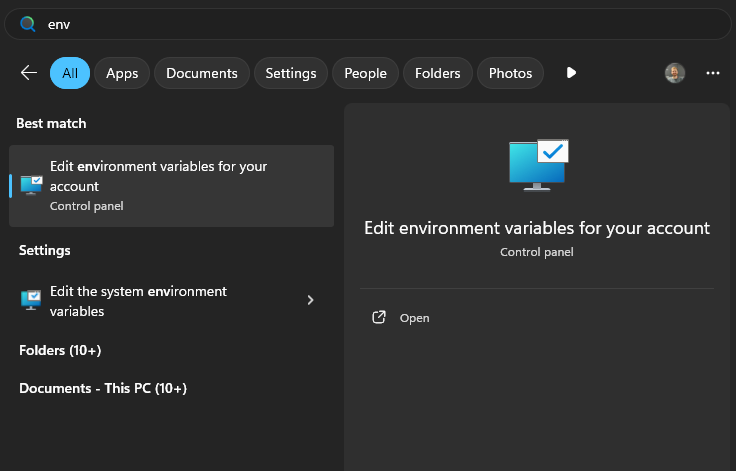
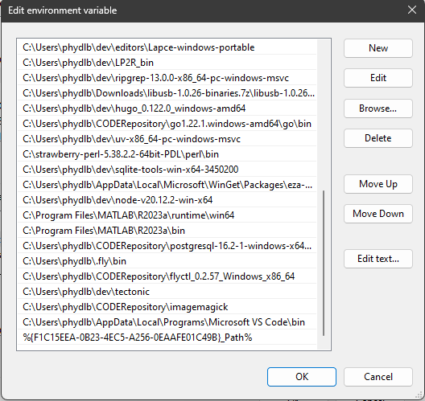
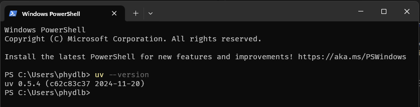
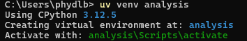
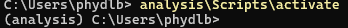
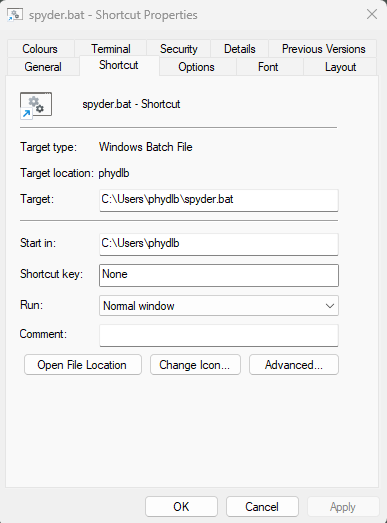
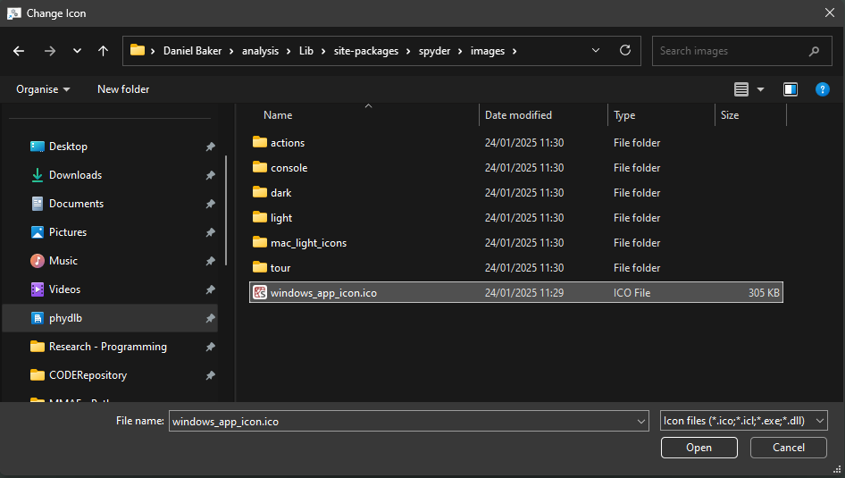

# Python 

Author: Dan Baker

## Installing Python


If you're reading this, you're likely looking for an alternative to Anaconda. My recommended approach to installing Python, and managing 3rd party packages and virtual environments, is uv. 

### Downloading uv


The recommended method to install uv on Windows is with their installation script (they advise copy/pasting a command into Powershell). This method will not work on university owned PCs if you do not have admin rights. The alternative is to go to the <a href="https://github.com/astral-sh/uv/releases" target="_blank">Releases</a> page and then download the relevant version for your CPU architecture (this will almost certainly be: uv-x86_64-pc-windows-msvc.zip). Download the .zip, extract the archive, and move the folder somewhere more sensible than 'Downloads'.

### Adding uv to Path

We would like to be able to access the uv binary from wherever we are in our userspace. To do this, we need to add uv to our Path: 

1. Copy the location of the uv.exe binary (i.e. the folder you extracted before). the easiest way to do this is to navigate to the location of uv.exe with File Explorer, click the 'address bar' at the top and Ctrl-C. 
2. Press the 'Windows' key on your keyboard or in the task bar and start typing 'Environment'. One of the options that pops up will say "Edit environment variables for your account". Click that. 
    <figure markdown>
     
    </figure markdown>
3. Find 'Path' in the 'User Variables' box and double click the 'Path' entry.
    <figure markdown>
    
    </figure markdown>
4. Click 'New' and paste in the path to the folder containing the uv.exe binary.
    <figure markdown>
    
    </figure markdown>
5. Open Powershell and type `uv --version`. This should return something like this:
    <figure markdown>
    
    </figure markdown>

### Using uv to install python

To install Python using uv, type this into Powershell: 

``` shell

uv python install
```

### Setting up a virtual environment for data analysis

!!! warning
    By default, Windows will not allow you to run 'scripts' in Powershell. This means you will not be able to 'activate' your virtual environment. To solve this, enter the following in Powershell:
    ``` shell
    
    Set-ExecutionPolicy RemoteSigned -scope CurrentUser
    ```

1. Open Powershell and navigate to the folder you would like to install your environment in (it doesn't matter where, as long as you know!)

2. Create a virtual environment as follows (I will be naming it 'analysis' but you can name it whatever you like.) 
    ``` shell

    uv venv analysis
    ```
    <figure markdown>
    
    </figure markdown>
3. Activate your environment using the activate script (copy/paste the text after 'Activate with:'). In this case:
    ``` shell

        analysis\Scripts\activate.ps1
    ```
    If you're successful, your prompt will have the name of your venv in brackets at the beginning: 

    <figure markdown>
    
    </figure markdown>

4. Install some 'relevant 3rd party analysis packages' (numpy, scipy, matplotlib, jupyter, pandas) using uv's package manager:

    ``` shell

    uv pip install numpy scipy matplotlib jupyter pandas

    ```

## Spyder

1. First activate the virtual environment you want to install Spyder in. For this example, I will be installing it in the 'analysis' venv we made before:

    ``` shell

    "C:\Users\USERNAME\analysis\Scripts\activate.ps1"
    ```
    If this is succesful, the venv name will appear in brackets at the beginning of the prompt.

2. Install Spyder using uv:

    ``` shell 

    uv pip install spyder
    ```

3. If you're doing this on a PC you have full control of (i.e. not a university one) you can now just type 'spyder' to run Spyder. If not, this will not work because the university blocks all unsigned executables and the 'spyder' command is installed in the environment as an .exe in the Scripts folder (go look!). We can solve this by invoking the ```start``` function from the spyder module instead:

    ``` shell

    python -m spyder.app.start
    ```

    Spyder will then open, eventually. Should be faster when you open it again.... 

### Making a shortcut to Spyder

Our method of running Spyder - activating our environment and then typing ```python -m spyder.app.start``` - is a bit cumbersome and annoying. Let's change that! Open a text editor (literally anything; notepad is fine) and type: 

``` 

C:\Users\USERNAME\analysis\scripts\python.exe -m spyder.app.start

```

Make sure to change the path to the 'python.exe' to the one that matches the environment you installed Spyder in! 
Save this file as "spyder.bat" (you can name it whatever you like, but you need to save it as a .bat). Double click on the file in file explorer, and Spyder will open! 

We can turn our .bat into a Desktop Shortcut by right clicking it and selecting "Send to - Desktop (create shortcut)". You can then change the icon of this shortcut by right clicking it, clicking 'Properties' and selecting 'Change Icon'.

<figure markdown>

</figure markdown>

If you want this to be the 'Spyder' icon, the go to: "your_environment_name\Lib\site-packages\spyder\images" and select 'windows_app_icon.ico'.


<figure markdown>

</figure markdown>

## VSCode

### Installation

Go to the <a href="https://code.visualstudio.com/" target="_blank">VSCode Website</a> and click 'Download for Windows'. Double click the installer, and install! It's a good idea to tick the box(es) to add 'Open with Code' to File Explorer. 

### Extensions

For working with Python files, I would recommend the following extensions: 

- Python
- Jupyter
- Error Lens
- Data Wrangler (requires Pandas)

