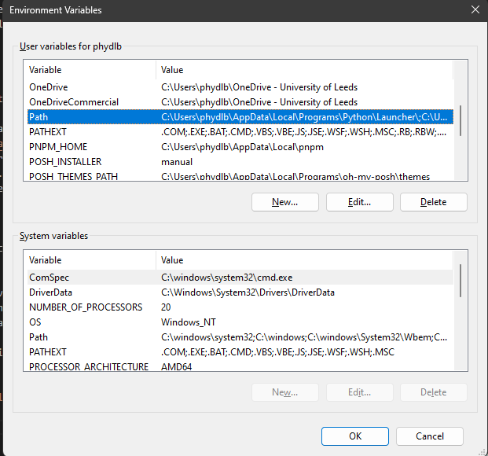

# Python 

Author: Dan Baker

## Installing Python


If you're reading this, you're likely looking for an alternative to Anaconda. My recommended approach to installing Python, and managing 3rd party packages and virtual environments, is uv. 

### Downloading uv

The recommended method to install uv on Windows is with their installation script (they advise copy/pasting a command into Powershell). This method will not work on university owned PCs if you do not have admin rights. The alternative is to go to the <a href="https://github.com/astral-sh/uv/releases" target="_blank">Releases</a> page and then download the relevant version for your CPU architecture (this will almost certainly be: uv-x86_64-pc-windows-msvc.zip). Download the .zip, extract the archive, and move the folder somewhere more sensible than 'Downloads'.

### Adding uv to Path

We would like to be able to access the uv binary from wherever we are in our userspace. To do this, we need to add uv to our Path: 

1. Copy the location of the uv.exe binary (i.e. the folder you extracted before). the easiest way to do this is to navigate to the location of uv.exe with File Explorer, click the 'address bar' at the top and Ctrl-C. 
2. Press the 'Windows' key on your keyboard or in the task bar and start typing 'Environment'. One of the options that pops up will say "Edit environment variables for your account". Click that. 
    <figure markdown>
     
    </figure markdown>
3. Find 'Path' in the 'User Variables' box and double click the 'Path' entry.
    <figure markdown>
    
    </figure markdown>
4. Click 'New' and paste in the path to the folder containing the uv.exe binary.
    <figure markdown>
    
    </figure markdown>
5. Open Powershell and type `uv --version`. This should return something like this:
    <figure markdown>
    
    </figure markdown>

### Using uv to install python

To install Python using uv, type this into Powershell: 

``` shell

uv python install
```

### Setting up a virtual environment for data analysis

!!! warning
    By default, Windows will not allow you to run 'scripts' in Powershell. This means you will not be able to 'activate' your virtual environment. To solve this, enter the following in Powershell:
    ``` shell
    
    Set-ExecutionPolicy RemoteSigned -scope CurrentUser
    ```

1. Open Powershell and navigate to the folder you would like to install your environment in (it doesn't matter where, as long as you know!)

2. Create a virtual environment as follows (I will be naming it 'analysis' but you can name it whatever you like.) 
    ``` shell

    uv venv analysis
    ```
    <figure markdown>
    
    </figure markdown>
3. Activate your environment using the activate script (copy/paste the text after 'Activate with:'). In this case:
    ``` shell

        analysis\Scripts\activate
    ```
    If you're successful, your prompt will have the name of your venv in brackets at the beginning: 

    <figure markdown>
    
    </figure markdown>

4. Install some 'relevant 3rd party analysis packages' (numpy, scipy, matplotlib, jupyter, pandas) using uv's package manager:

    ``` shell

    uv pip install numpy scipy matplotlib jupyter pandas

    ```